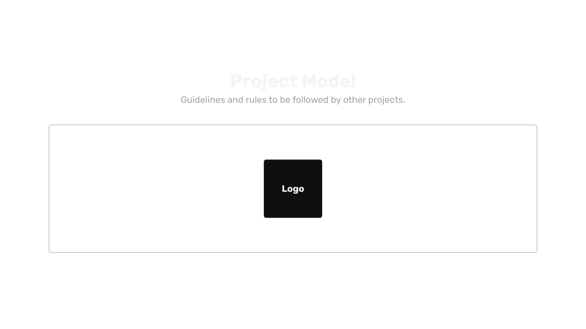

---

# Table of Contents
- [Intro](#intro)
- [Design](#design)
  * [The design process](#the-design-process)
  * [CSS framework](#css-framework)
    + [Colors](#colors)
    + [Spacing](#spacing)
  * [Figma Template](#figma-template)
- [Documentation](#documentation)
  * [Interactive Readme](#interactive-readme)
  * [Software](#software)
  * [Product](#product)
- [Technologies](#technologies)
  * [Finding out my project complexity level](#finding-out-my-project-complexity-level)
  * [Complexity 0](#complexity-0)
  * [Complexity 1](#complexity-1)
  * [Complexity 2](#complexity-2)

# Intro
This project defines rules and guidelines to be followed by other projects. All internal projects should follow theses rules.

This project-model should also facilitate de bootstrap of a new project as covers all product & project creation from scratch.

# Design
Inside this repository lies a highly customizable CSS framework to be used in internal projects.

There are some pre-built presets to use with this framework.

Read about the framework and how it works below:

## The design process
Style Guide => Design System => Ui Kit => Components

🚧 Work in progress 🚧

## CSS framework
🚧 Work in progress 🚧

### Colors
🚧 Work in progress 🚧
### Spacing
🚧 Work in progress 🚧

## Figma Template
🚧 Work in progress 🚧

Download the figma template that contains our whole CSS framework using CSS variables.

<file>

# Documentation
🚧 Work in progress 🚧
In the `documentation` folder you can find templates to be used for documentating your project.

Each template serves a different purpose.

## Interactive Readme
🚧 Work in progress 🚧

## Software
The software documentation category refers to the code part of the project. It showcases technology and inovation by the dev team.

## Product
The product documentation category refers to the product part of the project. It should show the problem vs solution, biggest "selling points" and the business perspective of building.

# Technologies
Inside the `tech` folder you can find templates to be used for the software.

Each tech stack serves a differente purpose.

The tech stacks are also divided in 3 (three) different complexity levels. The complexity levels are numbered from 0 onwards. The bigger the complexity level the more complex and far from the basic web technologies (HTML, CSS, Javascript) it is.

> Always try the simple route. When simple is not enough, go up one stack. (disclaimer: if you have the correct sense of complexity of your application, then use the appropriate stack for it.)

## Finding out my project complexity level
If you don't know how complex your app is, fill the form below and get a basic sense of it.

<form link>

## Complexity 0
## Complexity 1
## Complexity 2
